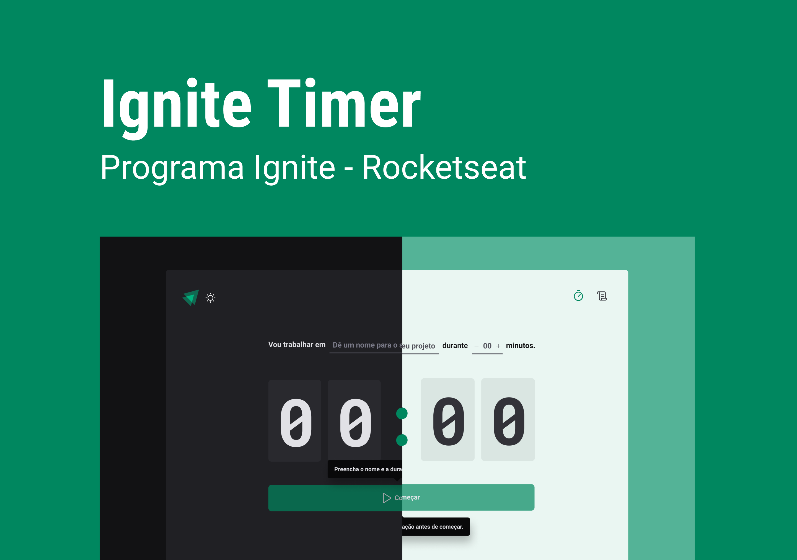

<p align="center">
  
</p>
<div align="center" id="top">
  <h1>Ignite Timer</h1>
  <p>
    
    
    
  </p>
  <P>
    <a href="#technologies">Technologies</a> &#xa0; | &#xa0;
    <a href="#requirements">Requirements</a> &#xa0; | &#xa0;
    <a href="#installation">Installation</a>
  </p>
</div>

## Technologies

- Vite
- React.Js
- TypeScript
- Phosphor
- Styled Components
- React Router Dom
- React Hook Form
- Reducer
- localStorage
- date-fns
- immer

## Requirements

- [Git](https://git-scm.com/)
- [Node.js](https://nodejs.org/en/)
- [Yarn](https://yarnpkg.com/)

## Installation

To make it run on your machine, follow the steps below

```bash
# Clone the repository in some folder on your machine
$ git clone git@github.com:ignite-projects/ignite-timer

# Enter the repository
$ cd ignite-timer

# Install the dependencies by typing in the terminal
$ yarn install

# Run the application
$ yarn dev
```

<div align="right">
Connect with me

[](https://www.linkedin.com/in/robsonnatanael)
[](https://twitter.com/robsonnatanael)
[](https://app.rocketseat.com.br/me/robsonnatanael)

</div>
